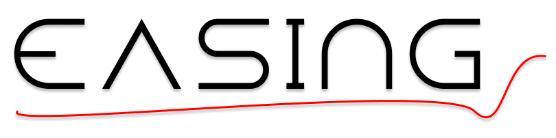
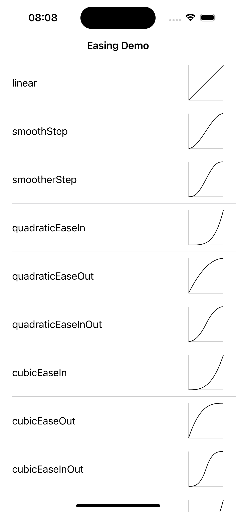
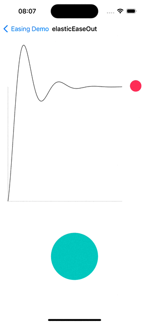

<p align="center">

</p>
Easing library is a comprehensive set of easing functions, useful for interactive animations and other time-based calculations where smooth transitions are necessary.

## Features

- Unified set of easing functions
- Easy-to-use 'swifty' API to invoke calculations
- Interpolation shorthands for the most popular primitive types like CGPoint, CGSize, CGTransform, UIColor and UIBezierPath
- Bridge to CAMediaTimingFunction
- Arbitrary cubic bezier based easings
- Interactive demo app
- Supports iOS 12.0+ / Mac OS X 10.13+ / tvOS 12.0+ / watchOS 4.0+ / visionOS 1.0+

## Usage

### Real world example

Imagine an interaction with a `UIScrollView` where its header is fully visible when the content offset is zero and fades out completely as the content offset exceeds 100 points. You can express this behavior with the following code in your `scrollViewDidScroll` method:

````swift
let minOffset = 0.0
let alphaForMinOffset = 0.0
let maxOffset = 100.0
let alphaForMaxOffset = 1.0
let offset = scrollView.contentOffset.y

headerView.alpha = Easing.quadraticEaseInOut.calculate(
    g1: minOffset,
    d1: alphaForMinOffset,
    g2: maxOffset,
    d2: alphaForMaxOffset,
    g: offset
)
````

### Interpolatable

````swift
let startTransform = CGAffineTransform.identity
let endTransform = CGAffineTransform(scaleX: 2, y: 2)

transformDemoView.transform = startTransform.interpolate(to: endTransform, progress: progress, easing: .linear)

````

## Reference

|  Easing   |  Curve   |
| :---: | :---: |
|`.linear`||
|`.smoothStep`||
|`.smootherStep`||
|`.quadraticEaseIn`||
|`.quadraticEaseOut`||
|`.quadraticEaseInOut`||
|`.cubicEaseIn`||
|`.cubicEaseOut`||
|`.cubicEaseInOut`||
|`.quarticEaseIn`||
|`.quarticEaseOut`||
|`.quarticEaseInOut`||
|`.quinticEaseIn`||
|`.quinticEaseOut`||
|`.quinticEaseInOut`||
|`.sineEaseIn`||
|`.sineEaseOut`||
|`.sineEaseInOut`||
|`.circularEaseIn`||
|`.circularEaseOut`||
|`.circularEaseInOut`||
|`.exponentialEaseIn`||
|`.exponentialEaseOut`||
|`.exponentialEaseInOut`||
|`.elasticEaseIn`||
|`.elasticEaseOut`||
|`.elasticEaseInOut`||
|`.backEaseIn`||
|`.backEaseOut`||
|`.backEaseInOut`||
|`.bounceEaseIn`||
|`.bounceEaseOut`||
|`.bounceEaseInOut`||
|`.caEaseIn`||
|`.caEaseOut`||
|`.caEaseInEaseOut`||
|`.cubicBezier(0.11, 0.87, 0.21, -0.88)`||

## Demo app
In the repo, you will find an interactive demo iOS app to experiment with different easings and discover the most suitable one for your needs.




## Integration

Use Swift Package Manager and add dependency to `Package.swift` file.

```swift
  dependencies: [
    .package(url: "https://github.com/psharanda/Easing.git", .upToNextMajor(from: "3.0.0"))
  ]
```

Alternatively, in Xcode select `File > Add Package Dependencies…` and add Easing repository URL:

```
https://github.com/psharanda/Easing.git
```

## References

The main set of easing functions is a Swift port of https://github.com/warrenm/AHEasing which is a port of https://github.com/ai/easings.net (https://easings.net)

`CubicBezierInterpolator` is a Swift port of `nsSMILKeySpline` code from Mozilla https://github.com/mozilla-services/services-central-legacy/blob/master/content/smil/nsSMILKeySpline.cpp

## Contributing

We welcome contributions! If you find a bug, have a feature request, or want to contribute code, please open an issue or submit a pull request.

## License

Easing is available under the MIT license. See the LICENSE file for more info.
